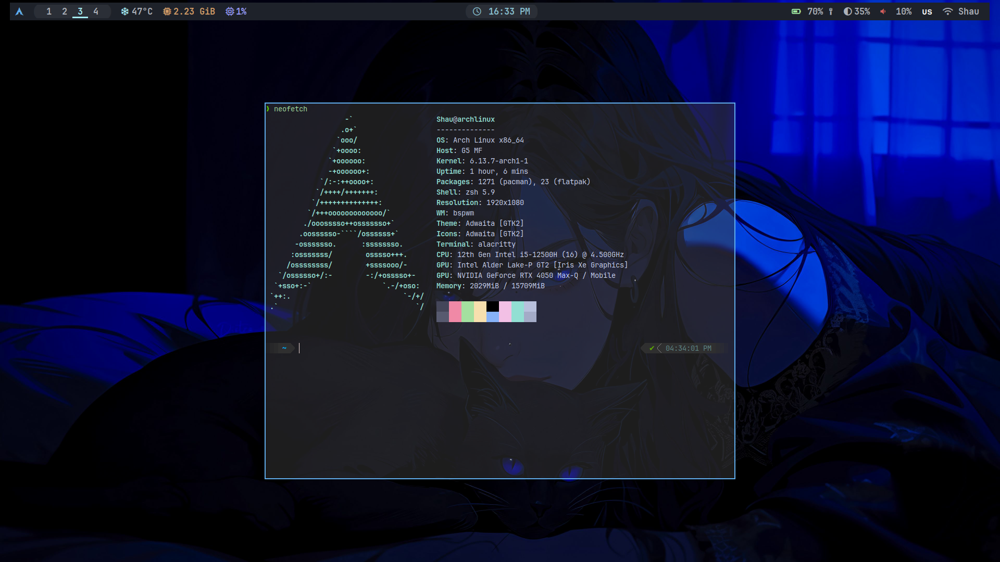
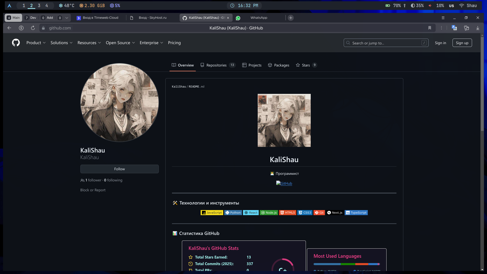
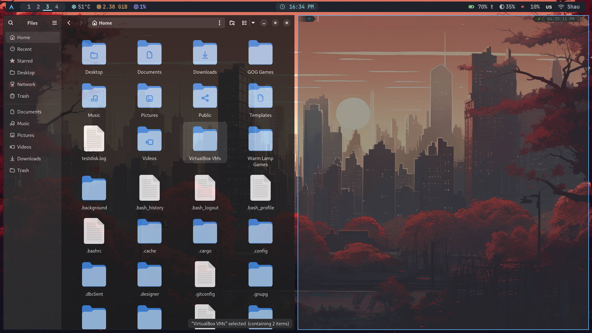

<h1 > BSPWM Dotfiles</h1>

**Минималистичная, быстрая и эстетичная конфигурация bspwm**  
Тёмные тона, акцент на функциональность и удобство.

## ✨ Особенности

- **Окружение**: `bspwm` + `sxhkd`
- **Тема**: Темные оттенки с акцентами (`#2b2f37`/`#a4ebf3`)
- **Шрифты**: [JetBrains Mono Nerd Font](https://www.nerdfonts.com/)
- **Утилиты**:
  - Менеджер окон: `bspwm` (таилинг + ручное управление)
  - Панель: `polybar` с кастомными модулями
  - Запуск программ: `rofi`
  - Уведомления: `dunst`
  - Композитинг: `picom` (анимации и прозрачность)
  - Терминал: `alacritty`

## 🛠 Установка

1. Скопировать репозиторий в каталог ~/Documents/Systems (для путей скриптов) и данную директорию в каталог ~/.config/
2. Скопировать конфиги `polybar`, `rofi`, `sxhkd`, `alacritty`, `.Xresources` в каталог ~/.config/

## 📦 Зависимости

- Пакеты: bspwm, sxhkd, rofi, polybar, networkmanager, libnotify, dunst, nm-connection-editor, brightnessctl
- Шрифты: ttf-jetbrains-mono-nerd, ttf-material-design-icons, ttf-unifont

## 🖼️ Картинки

