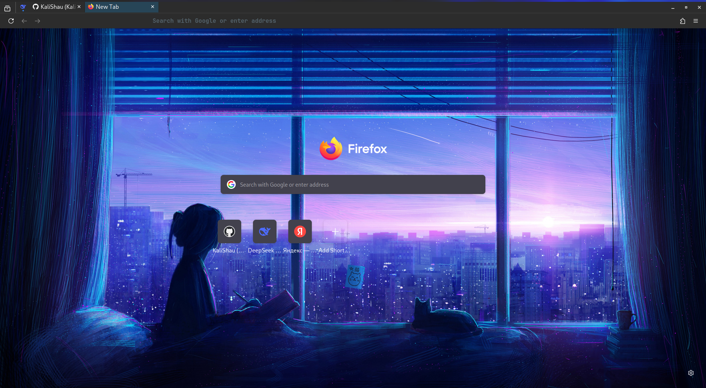
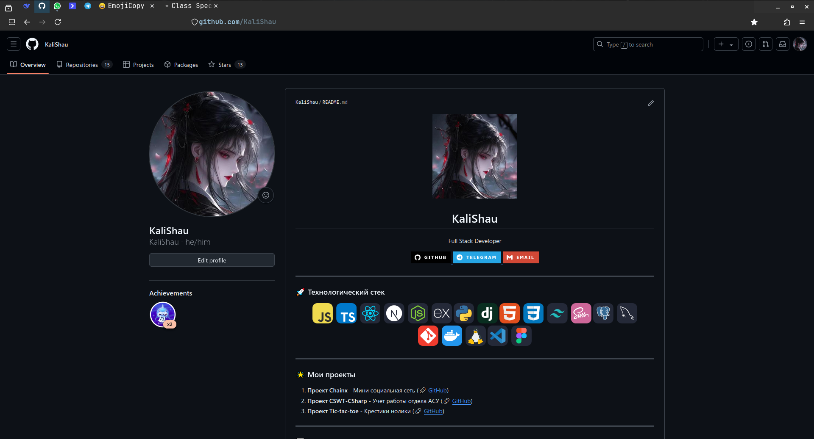

# Персонализированная конфигурация Firefox

Этот каталог содержит мою конфигурацию Firefox для оптимальной приватности, продуктивности и визуальной настройки.

## ✨ Основные особенности

- **Чистая стартовая страница** - Удалена вся реклама и спонсируемый контент
- **Улучшенная приватность** - Отключена телеметрия и функции отслеживания
- **Визуальные улучшения** - Кастомный интерфейс с компактными вкладками и тёмной темой
- **Удобные функции** - Полезные возможности адресной строки и горячие клавиши

## 🛠 Установка

Скопировать файлы в каталог ~/.mozilla/firefox/

## 🔧 Основные настройки

### Интерфейс

```javascript
// Включить кастомные CSS-стили
user_pref("toolkit.legacyUserProfileCustomizations.stylesheets", true);

// Компактный режим
user_pref("browser.compactmode.show", true);
user_pref("browser.uidensity", 1);
```

### Приватность

```javascript
// Отключить телеметрию
user_pref("datareporting.healthreport.uploadEnabled", false);
user_pref("toolkit.telemetry.enabled", false);

// Отключить рекламный контент
user_pref("browser.newtabpage.activity-stream.showSponsored", false);
user_pref("browser.newtabpage.activity-stream.showSponsoredTopSites", false);
```

### Функциональность

```javascript
// Калькулятор в адресной строке
user_pref("browser.urlbar.suggest.calculator", true);

// Открывать предыдущую сессию
user_pref("browser.startup.page", 3);
```

## 🎨 Скриншоты




